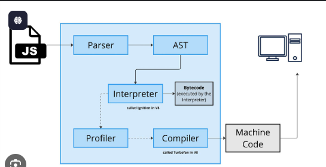

# JavaScript engine 

A JavaScript engine is a program that directly executes JavaScript code. It's the core component that takes the human-readable code written by developers and translates it into machine-level instructions that a computer's CPU can understand and execute.

Here's a breakdown of how a JavaScript engine generally works:

`Parsing`: The engine first parses the source code, converting it into a structured representation called an Abstract Syntax Tree (AST). The AST is a tree-like data structure that represents the syntactic structure of the code.

`Interpretation`: An interpreter then takes the AST and converts it into bytecode, a low-level representation of the code. The interpreter executes the code line by line, which allows for a fast start-up time.

`Just-in-Time (JIT) Compilation`: Modern JavaScript engines use a technique called JIT compilation to improve performance. The JIT compiler monitors the code as it runs and identifies "hot spots"—parts of the code that are executed frequently. It then compiles this code into highly optimized, faster machine code.

`De-optimization`: If the JIT compiler's assumptions about the code's behavior (e.g., data types) turn out to be wrong, the engine can "de-optimize" the machine code and revert to a less-optimized version. This ensures correct execution while still benefiting from optimization when possible.

`Memory Management`: The engine includes a call stack, which manages the execution context of functions, and a memory heap, where objects and dynamic data are stored. It also has a garbage collector that automatically reclaims memory that is no longer being used.

## Major JavaScript Engines
Each major browser and runtime environment uses its own JavaScript engine:

`V8`: Developed by Google, V8 powers Google Chrome, other Chromium-based browsers like Microsoft Edge and Brave, and the Node.js and Deno runtimes. It is known for its high performance.

`SpiderMonkey`: Developed by Mozilla, SpiderMonkey is the engine used in Firefox. It was the first-ever JavaScript engine, originally created by Brendan Eich.

`JavaScriptCore`: Developed by Apple, this engine is used in the Safari browser and the Bun runtime.

`Chakra`: A JavaScript engine initially developed by Microsoft for Internet Explorer and earlier versions of Edge. It has since been replaced by V8 in the Chromium-based version of Edge.

# V8 Engine 

The V8 is Google's open-source, high-performance JavaScript and WebAssembly engine, written in C++. It is a crucial component of Google Chrome, Node.js, and many other applications and frameworks.

