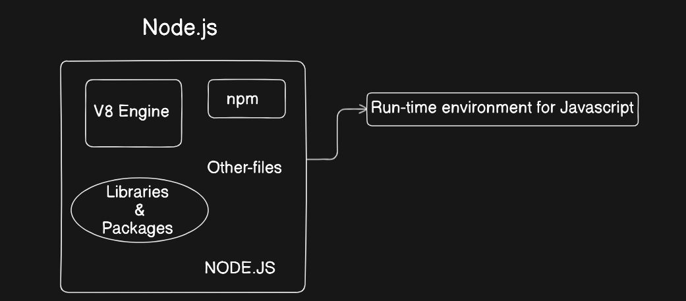

# Node js 
Node.js is a powerful, open-source, and cross-platform JavaScript runtime environment. It allows developers to run JavaScript code outside of a web browser, typically on the server side.

## Key Characteristics:

Built on V8 Engine: Node.js uses Google's high-performance V8 engine, the same one that powers Google Chrome. This ensures that Node.js is fast and efficient.

Asynchronous and Event-Driven: Node.js is built on a non-blocking, event-driven architecture. This makes it highly scalable and ideal for handling many concurrent connections, as seen in real-time applications, APIs, and microservices.

Single-Threaded: Node.js operates on a single-threaded event loop, which handles all I/O operations asynchronously. This avoids the overhead of managing multiple threads, leading to high performance.

## Core Use Cases:

Server-Side Development: Building fast and scalable web servers, APIs, and back-end services.

Real-Time Applications: Powering applications that require real-time communication, such as chat applications, online games, and collaborative tools.

Microservices: Creating small, independent services that communicate with each other, a popular architectural pattern.

Command-Line Tools: Building automated scripts and developer tools.

## Why Node.js is Popular:

Full-Stack JavaScript: It allows developers to use a single language (JavaScript) for both the front-end (browser) and back-end (server), simplifying development and team collaboration.

Vast Ecosystem: The Node Package Manager (npm) provides access to the world's largest ecosystem of open-source libraries, making it easy to add functionality to applications.

Scalability: Its non-blocking I/O model makes it highly efficient at handling concurrent requests, making it a good choice for applications that need to scale.