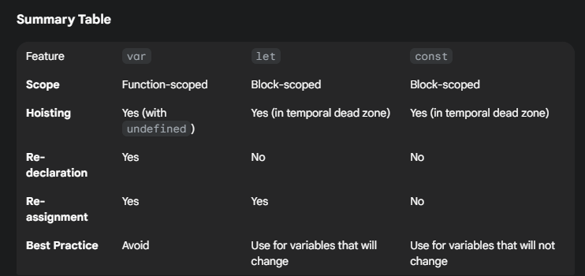

# 📦 Chapter 1: Variables & Declarations

## 🧠 What are Variables?
Variables are  like containers that hold data.

They help us store, reuse, and update information in JavaScript — from simple values like
numbers to complex data like arrays and objects.

Think of a variable as a box with a name on it. You can put something inside it (a value), and later
check or change what's inside.

In JavaScript, you create these boxes using keywords: `var` , `let` , or `const` .

Example : 
```js
let name = "Faraz";
const FatherName="Ahmad Jamal ";
var MotherName = "Nikhat Jamal ";

```

## let vs var vs const 

